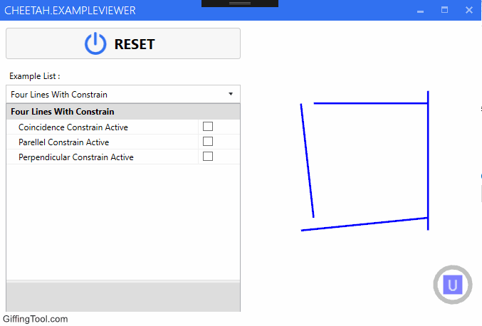

# **Cheetah.ExampleViewer**

This is a graphical viewer for experimenting with this [2D constrain solver library](https://github.com/CloudInvent/Cheetah.Examples)

To add more example :

1) add a new class to the project 

2) Implement [IExampleCode](https://github.com/tenacious/Cheetah.ExampleViewer/blob/master/Cheetah.ExampleViewer/Examples/IExampleCode.cs) interface to this new class

3) Run the project

Your new example code class will be available in drop-down list. 

To add parameter to your example , put **Display** attribute to related class property, in this way :

´´´

[DisplayName("Arc Radius Value")]
public double ArcRadiusValue { get; set; }

´´´
or 
        
´´´

[DisplayName("Equal Segment Constrain Active")]
public bool IsEqualSegmentActive { get; set; }

´´´

Take a look at [this](https://github.com/tenacious/Cheetah.ExampleViewer/blob/master/Cheetah.ExampleViewer/Examples/FourLinesWithConstrain.cs) and [this](https://github.com/tenacious/Cheetah.ExampleViewer/blob/master/Cheetah.ExampleViewer/Examples/RoundedRectangle.cs) code files, for reference.
____

Here a gif demo :

____

###References and links : 

[CloudInvent HOME](http://www.cloud-invent.com/)

[CloudInvent/Cheetah.Examples](https://github.com/CloudInvent/Cheetah.Examples)
_____

[Helix Toolkit](https://github.com/helix-toolkit)

[MahApps.Metro](https://github.com/MahApps/MahApps.Metro)

[Extended WPF Toolkit™ Community Edition](https://wpftoolkit.codeplex.com/)

____
